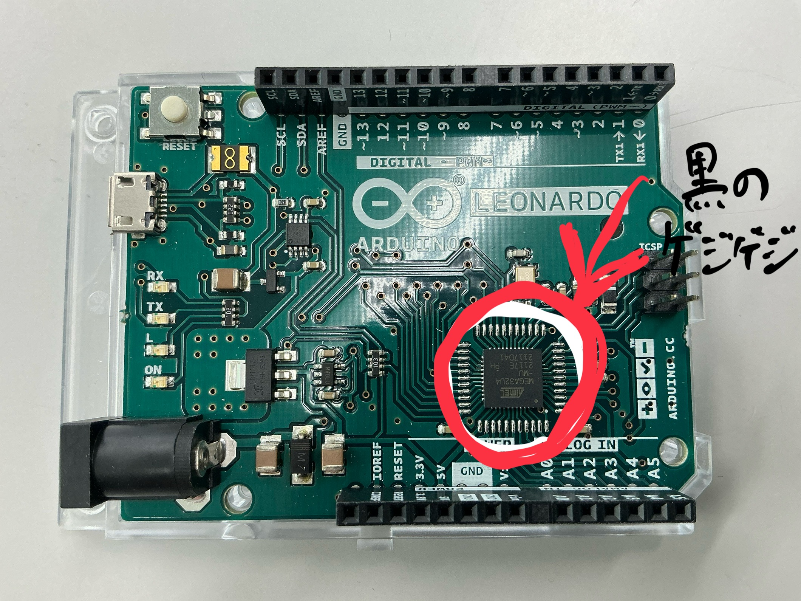
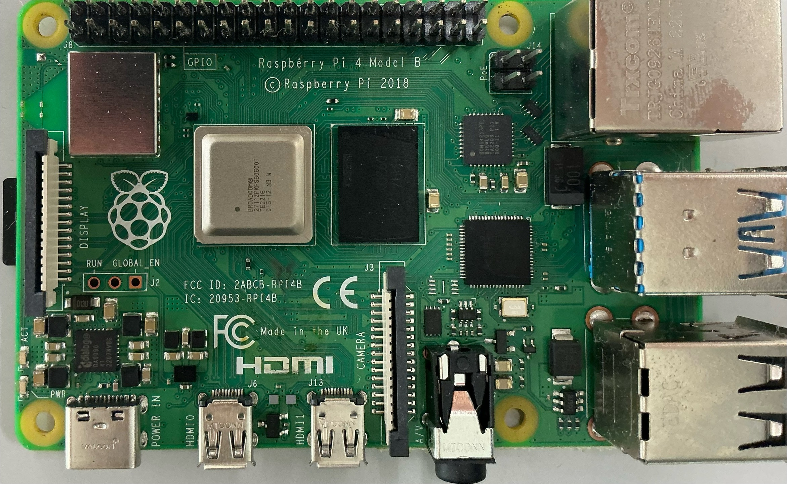

# マックの使い方

## この講座を受けるにあたって、あなたはどれに該当していますか?

* スマホやタブレットを触ったことがある
* パソコンを触ったことがある
* パソコンを毎日のように触っている
* キーボードはブラインドタッチで入力できる
* Macを持っている

> 本講座は、パソコンを毎日のように触っていることを前提に記述しています。
> そのため、もしそれ以前の方は、別の講座を受講することをお勧めします。ただし、必須というわけではありません。

## パソコンとは
世間一般にパソコンと言われる装置は、いま目の前にあるこのように画面を持っているものになります。パソコンとはパーソナルコンピュータの略称で、パーソナル、つまり個人用のコンピュータ端末のことを指します。私たちが目にして、認識するコンピュータの多くは、このパソコンとなります。

パソコンは、私たちの日常生活や仕事において欠かせないツールとなっています。文書作成、インターネットの閲覧、メールの送受信、写真や動画の編集など、さまざまな用途に利用されています。

## パソコンの歴史
パソコンは、1970年代後半から1980年代にかけて急速に普及しました。初期のパソコンは高価で、主に企業や研究機関で使用されていましたが、技術の進歩により、一般家庭にも普及するようになりました。現在では、ノートパソコンやデスクトップパソコン、タブレットなど、さまざまな形態のパソコンが存在しています。

パソコン以外のコンピュータとは？

パソコン以外のコンピュータには、マイコンやサーバーなどがあります。マイコンはテレビのリモコンや電子レンジなどの家電製品に使用されており、多くの場合、目につくことはありません。故障したリモコンを分解してみると、ICと呼ばれる黒い部品が入っています。

オンボードPC

昨今のパソコンは種類も用途も多岐にわたります。そのため、サーバーなどの機能を従来のパソコンで行うことも可能です。また、モニタに接続することが前提になっていますが、普段の運用ではモニタを繋がないことも可能です。
パソコンを最小構成で組み立てると次の写真のようなものだけで十分と言えます。ここにモニタやマウス、キーボードを接続することで、パソコンとして機能させることができます。(ラズパイをパソコンと言って言い切っていいか悩みどころですが、、、)

## WindowsとMacのOSの違い

WindowsとMacの違い

WindowsとMacは、それぞれ異なるオペレーティングシステム（OS）を搭載しています。WindowsはMicrosoft社が開発しており、世界中で広く使用されています。一方、MacはApple社が開発しており、特にクリエイティブな作業に強みがあります。具体的な違いについては、次の章で詳しく説明します。

## Macの特徴
Macは、Apple社が開発したパソコンで、独自のオペレーティングシステム（macOS）を搭載しています。Macの特徴として、以下の点が挙げられます。
* 直感的な操作性
* 高いデザイン性
* セキュリティの高さ
* クリエイティブな作業に強い

## Macの基本操作
Macの基本的な操作方法について簡単に説明します。
* **Finder**: ファイルやフォルダを管理するためのアプリケーションです。
* **Dock**: よく使うアプリケーションやファイルを簡単にアクセスできる場所です。
* **Spotlight**: ファイルやアプリケーションを素早く検索するための機能です。